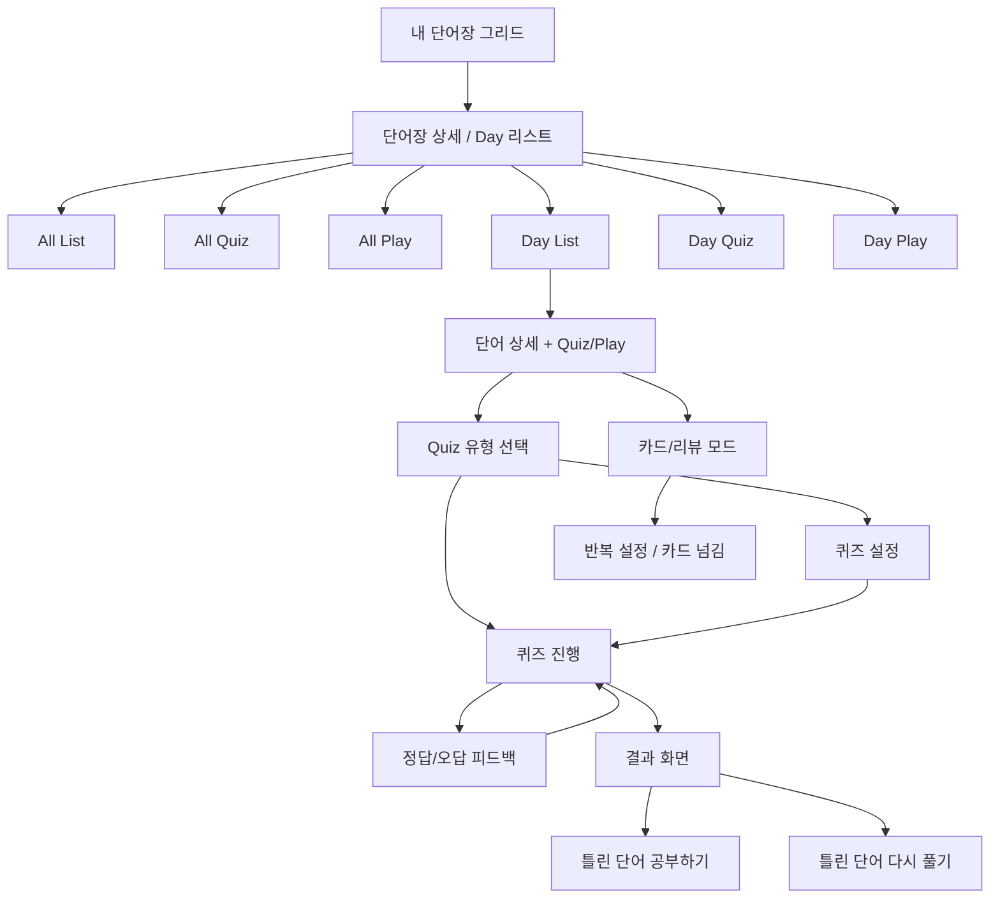
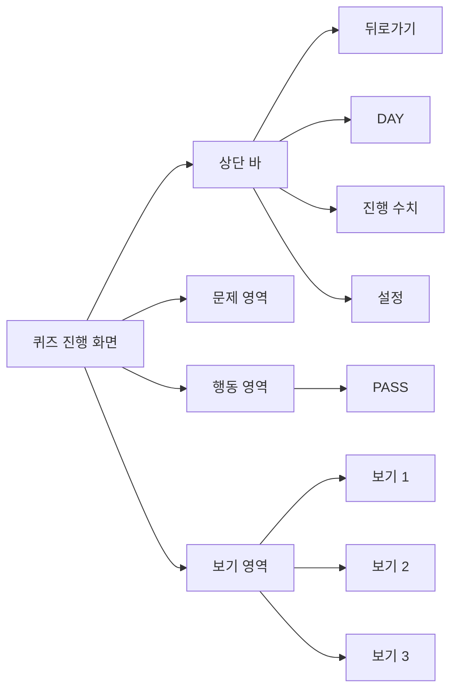

# Reference Screen Map

## 목적

이 문서는 참조 안드로이드 퀴즈앱의 화면을 기능별로 분해하고, 각 화면에서 사용자가 언제 어떤 버튼을 누르며 어디로 이동하는지 트리와 그래프로 정리한 문서다.

## 화면군 분류

| 화면군 | 대표 파일 | 역할 | 핵심 버튼/행동 |
| --- | --- | --- | --- |
| 내 단어장 그리드 | `1000016864.jpg`, `1000016865.jpg` | 덱/단어장 탐색 시작점 | 카드 탭, 검색, 우하단 추가 버튼 |
| 단어장 상세/Day 리스트 | `1000016863.jpg` | Day 단위 진입점 | `All List`, `All Quiz`, `All Play`, 각 Day의 `List / Quiz / Play` |
| 단어 상세 + 학습 진입 | `1000016843.jpg`, `1000016857.jpg` | 카드 내용 확인과 Quiz/Play 진입 | `Quiz`, `Play`, 정렬, 탭, 북마크 |
| 퀴즈 유형 선택 | `1000016844.jpg`, `1000016845.jpg` | 어떤 문제 유형으로 풀지 결정 | 상단 `모든 유형 랜덤 풀기`, 각 유형별 큰 버튼 |
| 퀴즈 설정 | `1000016851.jpg`, `1000016852.jpg`, `1000016854.jpg`, `1000016862.jpg` | 학습 옵션 상세 조정 | 토글, +/- 스테퍼, 라디오, 반복 설정 |
| 퀴즈 진행 | `1000016842.jpg`, `1000016846.jpg`, `1000016855.jpg`, `1000016856.jpg` | 실제 풀이 | 뒤로가기, 진행도, 설정, `PASS`, 보기 선택 |
| 카드/리뷰 모드 | `1000016859.jpg`, `1000016860.jpg`, `1000016861.jpg` | 카드 넘기며 상세 확인 | `반복 설정`, 일시정지, 슬라이더, 카드 스와이프 |
| 결과 화면 | 사용자 제공 첨부 이미지 `Image #1` | 세션 종료 후 결과 확인과 오답 재학습 진입 | `틀린 단어 공부하기`, `틀린 단어 다시 풀기`, 오답 목록 확인 |

## 화면별 상호작용 트리

### 1. 내 단어장 그리드

참조 파일:
- [1000016864.jpg](reference_app/New%20folder/1000016864.jpg)
- [1000016865.jpg](reference_app/New%20folder/1000016865.jpg)

트리:
- 내 단어장 진입
- 덱 카드 그리드 탐색
- 덱 카드 선택
- 덱/Day 리스트 화면으로 이동
- 또는 우하단 `+`로 새 단어장 생성

관찰 포인트:
- 카드가 이미지를 강하게 사용한다.
- 한 화면에 많은 덱이 보인다.
- 관리 기능은 카드면이 아니라 작은 오버레이 아이콘에 실린다.

### 2. 단어장 상세 / Day 리스트

참조 파일:
- [1000016863.jpg](reference_app/New%20folder/1000016863.jpg)

트리:
- 단어장 상세 진입
- 상단 요약 확인
- 전체 행동 선택
  - `All List`
  - `All Quiz`
  - `All Play`
- 또는 특정 Day 선택
  - `List`
  - `Quiz`
  - `Play`

관찰 포인트:
- Day마다 액션이 직접 붙어 있다.
- 잠금 Day는 시각적으로 즉시 구분된다.
- 상단 전체 행동과 Day별 행동이 계층 분리돼 있다.

### 3. 단어 상세 + Quiz/Play 진입

참조 파일:
- [1000016843.jpg](reference_app/New%20folder/1000016843.jpg)
- [1000016857.jpg](reference_app/New%20folder/1000016857.jpg)

트리:
- Day 진입
- 탭 선택
  - `모두`
  - `단어`
  - `뜻`
- 카드 상세 읽기
- 행동 선택
  - `Quiz`
  - `Play`
- 북마크 / 정렬 / 필터 사용

관찰 포인트:
- 학습 진입 전에도 카드 정보가 충분하다.
- `Quiz`와 `Play`가 같은 수준의 1차 행동으로 보인다.
- 정보 카드, 예문, 유의어, 반의어가 하나의 긴 스크롤 카드로 묶여 있다.

### 4. 퀴즈 유형 선택

참조 파일:
- [1000016844.jpg](reference_app/New%20folder/1000016844.jpg)
- [1000016845.jpg](reference_app/New%20folder/1000016845.jpg)

트리:
- 퀴즈 시작
- 유형 선택
  - `모든 유형 랜덤 풀기`
  - `뜻 선택하기`
  - `단어 선택하기`
  - `뜻 입력하기`
  - `단어 입력하기`
  - 기타 세부 모드
- 선택 즉시 세션 시작 또는 설정 확인

관찰 포인트:
- 유형 선택은 리스트가 아니라 큰 터치 버튼의 집합이다.
- 한 번에 많은 유형을 보여주지만 구조는 단순하다.
- 제목과 행동의 구분이 명확하다.

### 5. 퀴즈 설정

참조 파일:
- [1000016851.jpg](reference_app/New%20folder/1000016851.jpg)
- [1000016852.jpg](reference_app/New%20folder/1000016852.jpg)
- [1000016854.jpg](reference_app/New%20folder/1000016854.jpg)
- [1000016862.jpg](reference_app/New%20folder/1000016862.jpg)

트리:
- 설정 화면 열기
- 표시 관련 옵션 조정
- 채점 관련 옵션 조정
- 자동 넘김 / 자동 제출 / 제한 시간 조정
- 반복 순서와 재생 항목 조정
- 세션으로 복귀

관찰 포인트:
- 학습 중 조정하고 싶은 옵션을 거의 다 이 화면에 몰아 넣었다.
- 조정 UI는 전부 익숙한 제어 방식이다.
- 설정은 많지만 학습 화면 자체를 복잡하게 만들지 않는다.

### 6. 퀴즈 진행

참조 파일:
- [1000016842.jpg](reference_app/New%20folder/1000016842.jpg)
- [1000016846.jpg](reference_app/New%20folder/1000016846.jpg)
- [1000016855.jpg](reference_app/New%20folder/1000016855.jpg)
- [1000016856.jpg](reference_app/New%20folder/1000016856.jpg)

트리:
- 문제 표시
- 사용자는 아래 보기 중 하나 선택
- 결과 즉시 확인
  - 정답: 원형 강조 또는 심벌 강조
  - 오답: 큰 `X`와 정답 보기 강조
- `PASS` 가능
- 다음 문제로 이동

관찰 포인트:
- 화면의 중심은 오직 `문제`다.
- 상단 바는 아주 얇다.
- 보기는 세로로 크게 쌓여 있다.
- 풀이 중 다른 정보는 거의 없다.

### 7. 카드/리뷰 모드

참조 파일:
- [1000016859.jpg](reference_app/New%20folder/1000016859.jpg)
- [1000016860.jpg](reference_app/New%20folder/1000016860.jpg)
- [1000016861.jpg](reference_app/New%20folder/1000016861.jpg)

트리:
- `Play` 진입
- 한 장 카드 읽기
- 좌우 이동 또는 슬라이더 이동
- 반복 설정 / 일시정지 / 북마크 / 사전 검색

관찰 포인트:
- 이 모드는 `시험`이 아니라 `소비/복습` 모드다.
- 퀴즈 모드와 카드 모드의 역할이 명확히 분리돼 있다.

### 8. 결과 화면

참조 자료:
- 사용자 채팅 첨부 결과 화면 `Image #1`

트리:
- 세션 종료
- 상단 결과 헤더 확인
- 오답 목록 스캔
- 하단 행동 선택
  - `틀린 단어 공부하기`
  - `틀린 단어 다시 풀기`

관찰 포인트:
- 결과 화면이 `요약 + 오답 리스트 + 재학습 행동`을 한 화면에 담는다.
- 즉시 오답 복습으로 이어지는 점은 강하다.
- 다만 상단 결과 색면이 커서 정보 밀도가 높아지고 시선이 분산될 수 있다.

## 참조 앱 전체 상호작용 그래프

## 퀴즈 진행 화면 내부 버튼 그래프

## 현재 앱과 1:1로 비교해야 할 대상

| 비교 주제 | 참조 자료 | 현재 앱 파일 |
| --- | --- | --- |
| 문제 유형 선택 밀도 | `1000016844.jpg` | `study_capture/01-study-launcher-short-answer.png`, `study_capture/05-study-launcher-multiple-choice.png`, `study_capture/11-study-launcher-mixed.png` |
| 학습 진행 기본 상태 | `1000016842.jpg`, `1000016846.jpg` | `study_capture/02-short-answer-idle.png`, `study_capture/06-multiple-choice-idle.png` |
| 정답 피드백 | `1000016856.jpg` | `study_capture/03-short-answer-correct-hold.png`, `study_capture/07-multiple-choice-correct-hold.png` |
| 오답 피드백 | `1000016855.jpg` | `study_capture/04-short-answer-wrong-hold.png`, `study_capture/08-multiple-choice-wrong-hold.png` |
| 완료 후 다음 행동 | 사용자 첨부 결과 화면 `Image #1` | `study_capture/09-complete-with-wrong.png`, `study_capture/10-complete-perfect.png` |
| 덱/라이브러리 시각 밀도 | `1000016864.jpg`, `1000016865.jpg` | `current_app/manager.png` |
| Day 목록 구조 | `1000016863.jpg` | `src/windows/DeckDetailWindow.tsx` 구조 + `current_app/day-or-manager.png` |

## 해석 결론

참조 앱의 핵심은 `학습할 때는 극단적으로 단순하게`, `설정할 때는 별도 화면에서 풍부하게`, `탐색할 때는 이미지와 그리드로 빠르게`다. 현재 앱은 이 중 `설정 분리`와 `화면 분리`는 상당 부분 따라갔지만, `학습 집중도`, `라이브러리 밀도`, `결과 후 오답 복기 화면`은 아직 참조 앱 쪽이 강하다.
